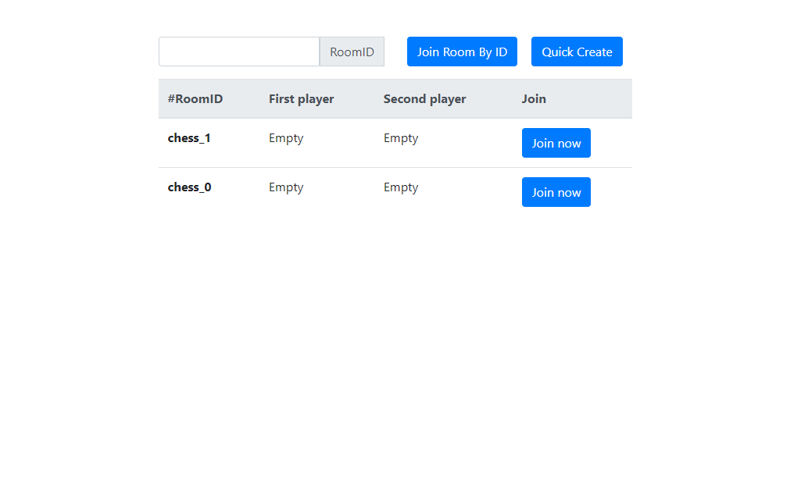
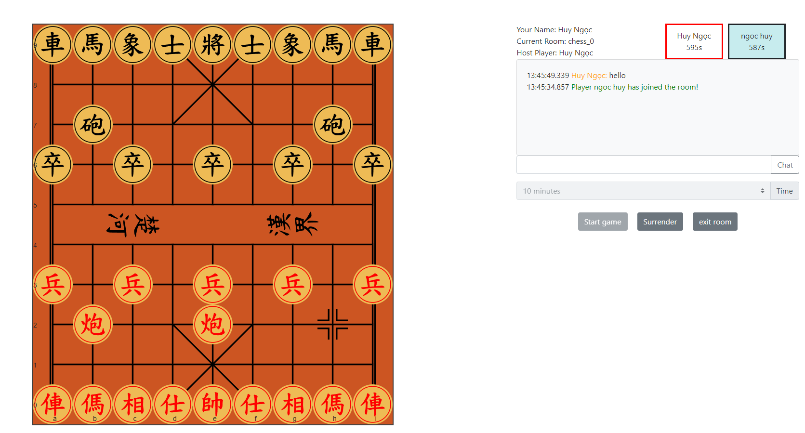

# F-Chess (Java)

A online xiangqi chess game built with Java && Socket.IO

## Features

- OAuth authentication
- Viewer supported
- Room chatting
- Auto reconnecting to the game

## Tech Stack

**Client:** jQuery, SocketIO

**Server:** Spring Boot, Spring Security, netty-socketio, PostgreSql, Docker

## Screenshots

